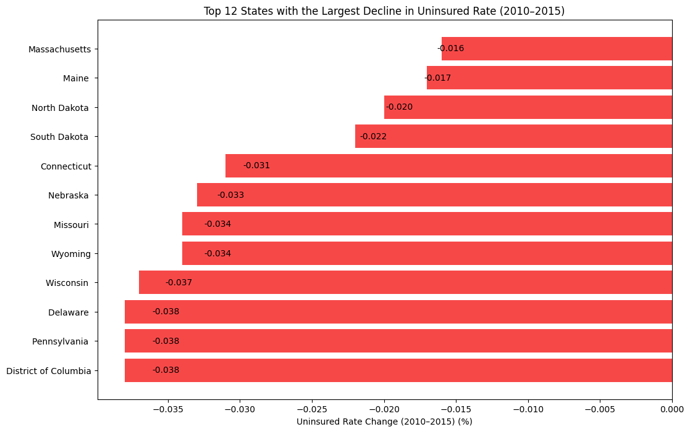
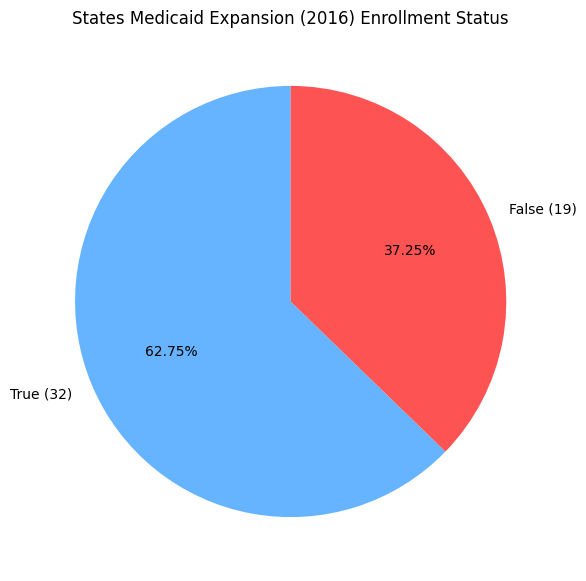
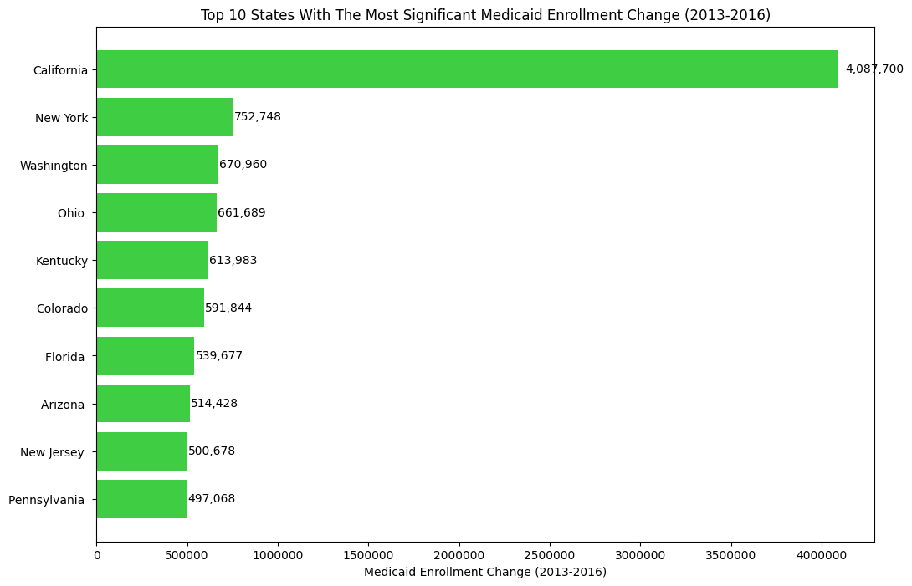
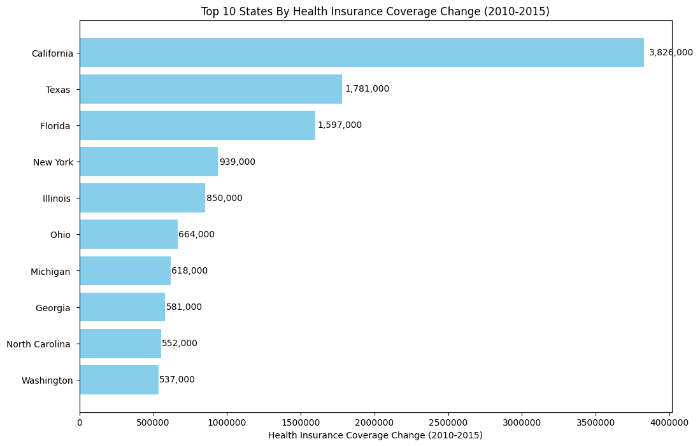
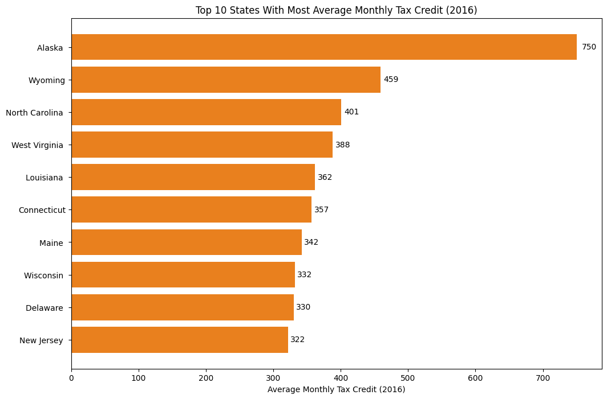
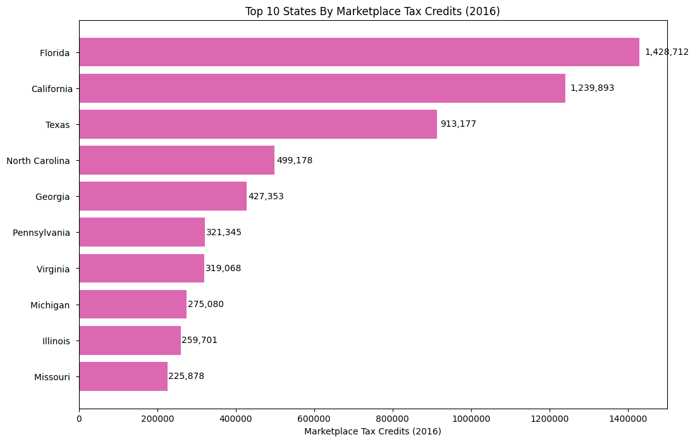
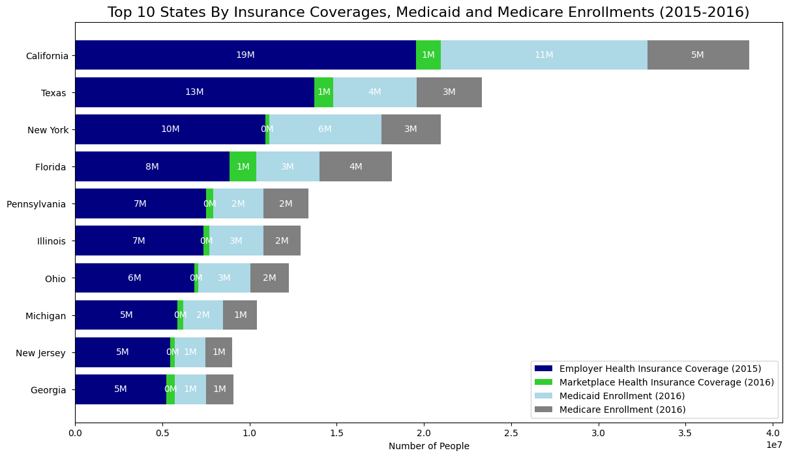

# US Health Insurance Coverage (2010-2016) Analysis

## 1. Project Overview

The Affordable Care Act (ACA), commonly known as Obamacare, represents one of the most impactful healthcare reforms in recent U.S. history. Signed into law in March 2010 during President Barack Obama’s administration, the ACA sought to tackle persistent challenges in the American healthcare system, focusing on access, affordability, and quality of care.

The years 2010 through 2016 were a pivotal period for healthcare in the United States. My project, US Health Insurance Coverage Analysis (2010-2016), explores this timeframe to reveal patterns and effects on insurance coverage.

This analysis examines shifts in uninsured rates, Medicaid and Medicare enrollment, participation in marketplace exchanges, and employer-provided insurance. By uncovering these trends, the project aims to support informed policymaking and contribute to efforts that expand healthcare access for all Americans. Join us as we explore insights from this critical period in health insurance coverage, working toward a more equitable healthcare system.

## Tools Used
- Python  
- Pandas   
- Matplotlib  
- Plotly 

## Objectives

This project conducts a detailed analysis of U.S. healthcare coverage from 2010 to 2016, focusing on state-level trends and key metrics:

- **Top States with Largest Decline in Uninsured Rate (2010-2016):** Identify states with the greatest reduction in uninsured rates and explore contributing factors like Medicaid expansion, marketplace enrollment, and outreach programs.  

- **Medicaid Expansion Status (2016):** Examine which states expanded Medicaid, comparing enrollment rates and healthcare access between expansion and non-expansion states.  

- **States with Significant Medicaid Enrollment Change (2013-2016):** Highlight states with the largest changes in Medicaid enrollment and investigate drivers such as economic shifts, demographics, and policy updates. 

- **States with Most Health Insurance Coverage Change (2010-2015):** Analyze states with notable changes in overall health insurance coverage, including employer-sponsored, Medicaid, and marketplace enrollment patterns. 

- **States by Average Monthly Tax Credit (2016):** Identify states with the highest average monthly marketplace tax credits and evaluate their role in improving insurance affordability.  

- **States by Total Marketplace Tax Credits (2016):** Assess the distribution of total marketplace tax credits across states and their impact on enrollment and affordability.  

- **Coverage Comparison Across Sources (2015-2016):** Compare states based on employee-sponsored insurance, marketplace coverage, Medicaid enrollment, and Medicare enrollment, highlighting variations across sources.  

- **Geographic Analysis of Uninsured Rate Change (2010-2016):** Visualize uninsured rate changes by state to highlight regional trends and states with the largest increases or decreases.

## Dataset Description

This dataset provides health insurance coverage information for all U.S. states and the country as a whole, covering the period around the implementation of the Affordable Care Act (ACA), commonly known as Obamacare. It includes variables such as uninsured rates before and after the ACA, estimates of individuals covered by employer and marketplace health plans, and enrollment in Medicare and Medicaid programs.  

The data was compiled from the **U.S. Department of Health and Human Services** and can be viewed [here](data/states.csv).  

The dataset contains **14 columns** and **52 rows**. Below is an overview of the dataset along with explanations of each column:

| Field                                      | Description                                                                                                                    |
|-------------------------------------------|--------------------------------------------------------------------------------------------------------------------------------|
| State                                      | The geographic entity under scrutiny, representing the diverse regions of the United States.                                   |
| Uninsured Rate (2010)                      | Percentage of individuals within a state who lacked health insurance coverage in 2010, showing population vulnerability.     |
| Uninsured Rate (2015)                      | Percentage of individuals without insurance in 2015, reflecting progress or regress in healthcare access over five years.    |
| Uninsured Rate Change (2010-2015)         | Magnitude and direction of change in uninsured rates from 2010 to 2015, providing insight into policy effectiveness.         |
| Health Insurance Coverage Change (2010-2015)| Overall change in health insurance coverage, capturing gains or losses over the five-year period.                             |
| Employer Health Insurance Coverage (2015)  | Proportion of individuals covered by employer-provided health insurance in 2015, highlighting workplace-based coverage.     |
| Marketplace Health Insurance Coverage (2016)| Extent of health insurance coverage obtained through ACA marketplace exchanges in 2016.                                       |
| Marketplace Tax Credits (2016)            | Financial assistance provided to eligible marketplace enrollees in 2016, reducing the cost of coverage.                     |
| Average Monthly Tax Credit (2016)         | Average monthly tax credit received by marketplace enrollees in 2016, indicating affordability of coverage.                  |
| State Medicaid Expansion (2016)           | Indicates whether a state expanded Medicaid under the ACA in 2016, influencing access for low-income residents.             |
| Medicaid Enrollment (2013)                | Number of individuals enrolled in Medicaid in 2013, a federal-state program for eligible low-income individuals and families.|
| Medicaid Enrollment (2016)                | Medicaid enrollment in 2016, illustrating changes in program participation over three years.                                  |
| Medicaid Enrollment Change (2013-2016)    | Net change in Medicaid enrollment from 2013 to 2016, reflecting shifts in eligibility, outreach, and enrollment procedures.  |
| Medicare Enrollment (2016)                | Number of individuals enrolled in Medicare in 2016, a federal program primarily for people aged 65 and older.               |

## Project Analysis: Key Performance Indicators (KPIs)

From the analysis, the following key findings were observed:

- **Total Uninsured Rate Change (2010-2016):** -277%  
- **Average Monthly Tax Credit (2016):** $292.16  
- **Total Health Insurance Coverage Change (2010-2015):** 19.59 million  
- **Total Employer Health Insurance Coverage (2015):** 172.29 million  
- **Total Marketplace Health Insurance Coverage (2016):** 11.08 million  
- **Total Marketplace Tax Credit (2016):** $9.39 million  
- **Total Medicaid Enrollment (2016):** 73.53 million  
- **Total Medicare Enrollment (2016):** 55.89 million  

## Top 10 States with the Largest Decline in Uninsured Rate (2010-2016)

The analysis identifies the states with the most significant reductions in uninsured rates from 2010 to 2016:

### Insights

- **Medicaid Expansion:** Many top-performing states, including Massachusetts, Connecticut, and Delaware, expanded Medicaid under the ACA, providing coverage to more low-income individuals and contributing to the decline in uninsured rates.  

- **Marketplace Enrollment:** States with successful marketplace enrollment initiatives, such as Connecticut and the District of Columbia, increased access to affordable health insurance. Subsidies and tax credits further supported coverage affordability.  

- **Outreach and Education:** Active promotion of healthcare enrollment through outreach campaigns, as seen in Massachusetts and Connecticut, helped raise awareness and encouraged more individuals to enroll in health insurance plans.  

- **State-Specific Policies:** Some states, like Massachusetts, had pre-existing healthcare reform initiatives prior to the ACA. These policies, combined with ACA provisions, supported significant reductions in uninsured rates.  

- **Economic Factors:** Economic stability and low unemployment in states like North Dakota and Nebraska likely contributed to fewer uninsured individuals by increasing access to employer-sponsored insurance and financial security among residents.

## States Medicaid Expansion (2016) Enrollment Status

This analysis compares Medicaid expansion enrollment across U.S. states, highlighting differences in enrollment rates and potential healthcare outcomes between expansion and non-expansion states.

### Medicaid Expansion Enrollment Status
- Out of 51 states (including Washington D.C.), **32 states (62.75%)** expanded Medicaid under the ACA.  
- **19 states (37.25%)** chose not to expand Medicaid.

### Comparison of Enrollment Rates
- States that expanded Medicaid have significantly higher enrollment rates than non-expansion states.  
- Expansion states benefited from federal funding under the ACA to extend Medicaid eligibility to individuals with incomes up to 138% of the federal poverty level, allowing more low-income individuals and families to gain healthcare coverage.

### Healthcare Outcomes in Expansion States
- **Reduced Uninsured Rates:** Expansion states saw significant declines in uninsured rates due to increased Medicaid coverage, improving access to preventive care, chronic disease management, and essential health services.  
- **Improved Access to Care:** Medicaid expansion increased access to primary care providers, specialists, and hospitals, leading to better health outcomes and reduced reliance on emergency care.  
- **Economic Benefits:** Expansion states gained federal funding, created jobs in the healthcare sector, and reduced uncompensated care costs for hospitals and providers.

### Impact of Non-Expansion States
- **Higher Uninsured Rates:** Non-expansion states maintain higher uninsured rates, limiting timely access to healthcare for low-income residents.  
- **Limited Access to Care:** Residents may face challenges obtaining affordable healthcare, resulting in delayed care, poorer outcomes, and wider healthcare disparities.  
- **Financial Strain:** Non-expansion states may incur higher costs from uncompensated care, placing additional strain on state budgets.

## Top 10 States with the Most Significant Medicaid Enrollment Change (2013-2016)

This analysis identifies the top 10 states with the largest changes in Medicaid enrollment from 2013 to 2016, exploring economic, demographic, and policy factors that drove these changes, as well as the impact of Medicaid expansion and outreach initiatives.
 
### Factors Driving Enrollment Changes
- **Economic Conditions:** Changes in unemployment, income levels, and job losses influence Medicaid eligibility and enrollment needs.  
- **Demographic Shifts:** Aging populations, migration patterns, and birth rates affect demand for Medicaid services in different age groups and communities.  
- **Policy Changes:** Medicaid expansion under the ACA allowed more low-income adults to qualify for coverage, resulting in substantial enrollment increases in expansion states.  
- **Outreach and Enrollment Initiatives:** Targeted campaigns, simplified applications, and community-based assistance helped eligible individuals enroll in Medicaid, increasing overall participation.

### Insights into Medicaid Expansion and Enrollment Initiatives
- **Effectiveness of Medicaid Expansion:** States like California, New York, and Washington experienced significant enrollment gains due to expanded eligibility, improving access to healthcare and reducing uninsured rates.  
- **Success of Outreach Initiatives:** States such as Colorado and Kentucky achieved notable enrollment increases through proactive outreach, addressing barriers like lack of awareness, language challenges, or limited access.

## Top 10 States by Health Insurance Coverage Change (2010-2015)

This analysis highlights the top 10 states with the most notable changes in health insurance coverage from 2010 to 2015, examining the impact of Medicaid expansion, marketplace enrollment, economic conditions, and demographic shifts.

### Impact of Various Factors on Coverage Change
- **Medicaid Expansion:** States like California and New York saw significant increases in coverage due to Medicaid expansion under the ACA, which extended eligibility to low-income adults and reduced uninsured rates.  
- **Marketplace Enrollment:** States with successful marketplace initiatives, such as California and Florida, experienced higher coverage rates through subsidized health insurance plans. Tax credits and subsidies improved affordability and enrollment.  
- **Economic Conditions:** Robust economic growth in states like California and Texas increased employer-sponsored insurance as businesses expanded, boosting coverage among working-age adults.  
- **Demographic Shifts:** ACA provisions benefited specific groups, including young adults (allowed to stay on parents’ plans until age 26) and minority communities reached through targeted outreach programs, reducing disparities in coverage.

### Demographic Groups and Regions Experiencing Significant Shifts
- **Young Adults:** Increased coverage due to ACA provisions allowing continuation on parents’ insurance plans.  
- **Low-Income Adults:** Gained access primarily through Medicaid expansion and broader eligibility criteria.  
- **Urban vs. Rural Areas:** Urban areas with higher population density saw greater coverage increases, while rural regions faced more limited access to healthcare services and insurance options.

## Top 10 States with the Highest Average Monthly Tax Credits (2016)

This analysis identifies the top 10 states by average monthly tax credit in 2016, examining the effectiveness of tax credits in improving affordability and access to health insurance, as well as geographic and demographic patterns of distribution.

### Effectiveness of Tax Credits in Improving Affordability and Access
- **Affordability:** Tax credits reduced out-of-pocket costs for premiums, co-payments, and deductibles, making coverage more affordable. States with higher average credits, such as Alaska and Wyoming, saw greater reductions in costs.  
- **Access:** Increased affordability encouraged higher enrollment in marketplace plans, expanding coverage and improving access to preventive care and medical treatment.

### Geographic and Demographic Patterns
- **Geographic Distribution:** States with higher average tax credits were often those with higher healthcare costs or lower incomes. Rural states with smaller populations, like Alaska and Wyoming, tended to offer larger tax credits.  
- **Demographic Distribution:** Tax credits benefited low-income households, young adults, and older adults. Younger individuals and lower-income families typically qualified for larger credits, while older adults often received smaller subsidies.

### Assessment of Effectiveness
Tax credits significantly improved access and affordability for millions of Americans, particularly low-income individuals. States with higher average monthly credits experienced greater reductions in uninsured rates and higher marketplace enrollment. However, disparities remain, with some states and demographic groups receiving larger subsidies than others. Addressing these gaps is essential to ensure equitable access to affordable coverage and progress toward universal healthcare.

## Top 10 States by Marketplace Tax Credits (2016)

This analysis examines the top 10 states by total marketplace tax credits in 2016, focusing on the distribution and impact of these credits on marketplace enrollment and affordability. It also highlights states with successful marketplace subsidy programs.

### Distribution and Impact of Tax Credits
- **Enrollment Impact:** States with higher marketplace tax credits generally experienced higher enrollment in marketplace health plans. Tax credits reduced the cost of monthly premiums, making coverage more affordable and encouraging more individuals to enroll, thereby reducing uninsured rates.  
- **Affordability:** Tax credits significantly improved affordability for low- and moderate-income individuals and families, enabling access to health insurance and improving financial security and healthcare access.

### States with Successful Marketplace Subsidy Programs
- **Florida:** High marketplace tax credits combined with effective outreach programs resulted in increased enrollment and improved coverage rates.  
- **California:** Substantial tax credits and proactive enrollment initiatives contributed to high participation in marketplace plans, improving affordability and access.  
- **Texas:** Despite being a non-expansion state, marketplace tax credits successfully incentivized enrollment, showing the effectiveness of subsidies in improving coverage and affordability.

## Top 10 States By Employer Health Insurance Coverage (2015), Marketplace Health Insurance Coverage (2016), Medicaid Enrollment (2016), and Medicare Enrollment (2016):

This analysis compares the top 10 states by employer health insurance coverage (2015), marketplace health insurance coverage (2016), Medicaid enrollment (2016), and Medicare enrollment (2016). It highlights variations in coverage sources, enrollment rates, and the effectiveness of different programs and initiatives.

### Comparison of States Based on Coverage Sources
- **Employer Health Insurance Coverage:** States like California, New York, and Texas have the highest employer-sponsored coverage, reflecting strong workplace-based insurance systems.  
- **Marketplace Health Insurance Coverage:** California, Florida, and Texas show substantial marketplace enrollment, indicating effective outreach and marketplace initiatives.  
- **Medicaid Enrollment:** New York, California, and Florida have the highest Medicaid enrollment, reflecting successful expansion efforts and outreach targeting low-income populations.  
- **Medicare Enrollment:** California, Texas, and Florida have significant Medicare enrollment, likely due to larger elderly populations and effective outreach to eligible residents.

### Variations in Coverage and Access Across States
- States with high employer-sponsored coverage may have lower enrollment in marketplace plans or Medicaid, showing reliance on workplace insurance.  
- Medicaid expansion states generally see higher enrollment and lower uninsured rates compared to non-expansion states.  
- Rural and lower-income communities often rely more on Medicaid and marketplace coverage due to limited access to employer-based insurance.  
- Young adults and low-income individuals disproportionately depend on marketplace plans and Medicaid, emphasizing the need for targeted outreach.

### Effectiveness of Coverage Programs and Initiatives
- **Employer-sponsored insurance** remains a major source of coverage in states with high workplace insurance rates.  
- **Medicaid expansion** effectively increased coverage and reduced uninsured rates in expansion states, demonstrating the impact of policy decisions.  
- **Marketplace exchanges** provide vital access to affordable insurance for those ineligible for employer coverage or Medicaid, particularly low-income and young adults.

## Uninsured Rate Change by States (2010-2015)

This analysis examines changes in uninsured rates across U.S. states from 2010 to 2015, using geographic visualization to highlight states with significant reductions or increases. It provides insights into regional trends, coverage disparities, and areas needing targeted interventions.

### Geographic Visualization of Uninsured Rate Change
- Maps and visualizations illustrate variations in uninsured rates across states and regions over time.  
- States are represented by circles of varying sizes based on their uninsured rates, allowing clear interpretation of trends.

### Understanding Regional Trends
- Certain regions, such as the Northeast and West Coast, generally experienced greater reductions in uninsured rates due to Medicaid expansion and strong marketplace enrollment.  
- Southern and Midwestern states often showed slower progress, potentially due to lower Medicaid eligibility thresholds, resistance to expansion, or economic challenges.

### Disparities in Coverage
- Visualizations reveal differences between urban and rural areas, with urban regions typically having lower uninsured rates.  
- Racial and ethnic disparities are evident, with minority communities experiencing higher uninsured rates than non-Hispanic white populations.

### Identification of Areas Requiring Targeted Interventions
- States or regions with persistently high uninsured rates or minimal improvements may need targeted policies and programs.  
- Interventions can include Medicaid expansion, increased funding for outreach and enrollment, and investment in healthcare infrastructure.  
- Collaboration between federal, state, and local governments, healthcare providers, and community organizations is essential to reduce disparities and improve access to care.

## Observed Outcomes

The analysis aimed to provide insights into U.S. healthcare coverage trends from 2010 to 2016, with the following key outcomes:

- **Top 10 States with the Largest Decline in Uninsured Rate (2010-2016):** Identified states with the biggest reductions in uninsured rates and understand contributing factors such as Medicaid expansion and marketplace enrollment. Highlighted successful strategies that can inform future healthcare policy.  

- **State Medicaid Expansion Status (2016):** Assessed the impact of Medicaid expansion on coverage and access. Compared enrollment rates and healthcare outcomes between expansion and non-expansion states.  

- **Top 10 States with Most Significant Medicaid Enrollment Change (2013-2016):** Identified states with major changes in Medicaid enrollment and explore economic, demographic, and policy factors driving these changes. Evaluated the effectiveness of expansion and enrollment initiatives.  

- **Top 10 States by Health Insurance Coverage Change (2010-2015):** Analyzed states with notable changes in overall health insurance coverage. Examined the role of Medicaid expansion, marketplace enrollment, and demographic patterns in coverage shifts.  

- **Top 10 States by Average Monthly Tax Credit (2016):** Identified states where individuals received the highest average monthly marketplace tax credits. Evaluated the effectiveness of tax credits in improving affordability and access, and explored geographic and demographic trends.  

- **Top 10 States by Total Marketplace Tax Credits (2016):** Assessed states receiving the highest total marketplace tax credits. Understood the distribution, impact on enrollment, and identified states with successful subsidy programs.  

- **Top 10 States by Employee Health Insurance Coverage (2015), Marketplace Coverage (2016), Medicaid Enrollment (2016), and Medicare Enrollment (2016):** Compared states across different coverage sources and enrollment levels. Highlighted variations and effectiveness of different programs.  

- **Uninsured Rate Change by States (2010-2016):** Created geographic visualizations to highlight states with the largest increases or decreases in uninsured rates. Identified regional trends, disparities in coverage, and areas needing targeted interventions.  
